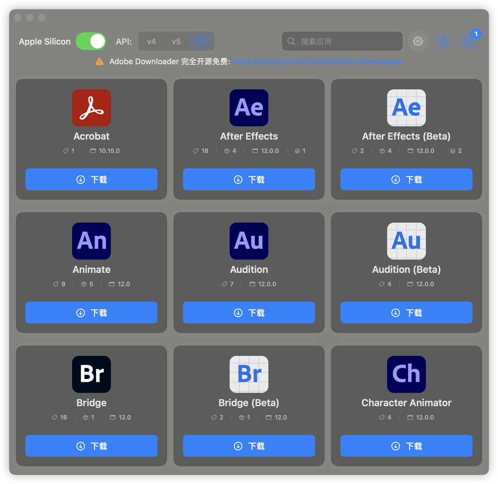
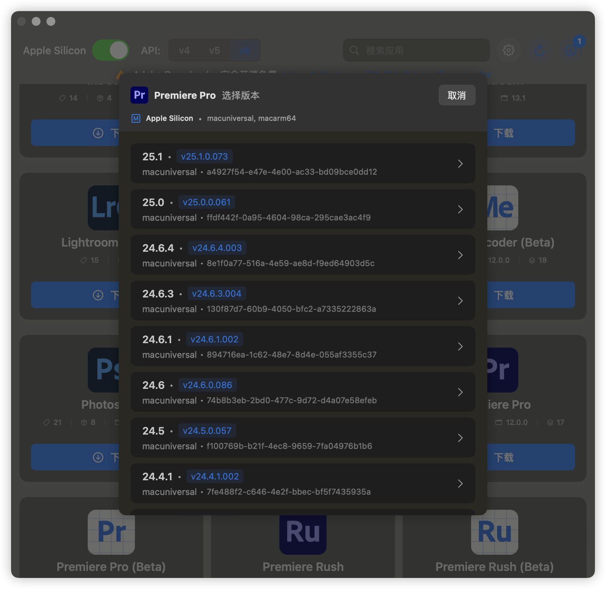

# Adobe Downloader


# **[中文版本](readme.md)**

## Before Use

> ⚠️ This repository does not support any PR submission

**Due to the rewritten Helper in v2.1, the minimum macOS requirement is now 13.0+ (no longer supports 12.0).**
**🍎Only for macOS 13.0+.**

> **If you like Adobe Downloader, or it helps you, please Star🌟 it.**
>
> 1. Before installing Adobe products, the Adobe Setup component must be present on your system; otherwise, the
     installation feature will not work. You can download it through the built-in “Settings” in the program or
     from [Adobe Creative Cloud](https://creativecloud.adobe.com/apps/download/creative-cloud).
> 2. To enable smooth installation after downloading, Adobe Downloader needs to modify Adobe’s Setup program. This
     process is fully automated by the program and requires no user intervention. Many thanks
     to [QiuChenly](https://github.com/QiuChenly) for providing the solution.
> 3. If you encounter any problems, don't panic, contact [@X1a0He](https://t.me/X1a0He_bot) on Telegram or use the
     Python
     version. Many thanks to [Drovosek01](https://github.com/Drovosek01) for
     the [adobe-packager](https://github.com/Drovosek01/adobe-packager)
> 4. ⚠️⚠️⚠️ **All Adobe apps in Adobe Downloader are from official Adobe channels and are not cracked versions.**
> 5. ❌❌❌ **Do not use an external hard drive or any USB to store it, as this will cause permission issues, I do not have
     the patience to solve any about permission issues**

## FAQ

**This section will be updated periodically with meaningful issues that have been raised.**

### **[NEW] About error codes and Helper**

Before version 1.3.0, many operations required users to enter passwords because root permissions or higher permissions
were not obtained

Therefore, we introduced the Helper mechanism in version 1.3.0. You only need to install the Helper and then the
subsequent Setup component processing. Product installation no longer requires entering a password

You may see relevant prompts in the upper right corner. Please rest assured that your system is very safe. This is
because of macOS's Helper mechanism and signed pop-up windows

If you are still worried about problems, please find a professional to check the relevant code, although it is futile

### Questions about the Setup Component

> It’s mentioned in the usage instructions that to use the installation feature, you need to modify Adobe’s setup
> component. You can find details in the code.

Why is this necessary? Without modifications, installation will fail with error code 2700.

> **Does the setup modification require user intervention?**

No, Adobe Downloader automates the setup component handling, including backup. All you need to do is enter your password
when prompted.

<a href="https://star-history.com/#X1a0He/Adobe-Downloader&Timeline">
 <picture>
   <source media="(prefers-color-scheme: dark)" srcset="https://api.star-history.com/svg?repos=X1a0He/Adobe-Downloader&type=Timeline&theme=dark" />
   <source media="(prefers-color-scheme: light)" srcset="https://api.star-history.com/svg?repos=X1a0He/Adobe-Downloader&type=Timeline" />
   
 </picture>
</a>

## 📔Latest Log

- For historical update logs, please go to [Update Log](update-log.md)

- 2025-07-20 Update Log

```markdown
1. Added feature to cancel Setup before installation.
2. Added concurrency control for downloads.
3. Rewritten version selection interface using NavigationStack with package customization.
4. Rewritten download logic with thread pooling + segmented downloading for parallel package fetching.
5. Rewritten Helper logic using SMAppService \(macOS 13.0+\).
6. Refined breathing light indicator for Helper connection status.
```

### Language friendly

- [x] Chinese
- [x] English

## ⚠️ Warning

**If you have any optimization suggestions or questions about Adobe Downloader, please open an issue or
contact [@X1a0He](https://t.me/X1a0He_bot)
via Telegram.**

## ✨ Features

- [x] Basic 📦
    - [x] Download Acrobat Pro
    - [x] Download other Adobe products
    - [x] Support installation of non-Acrobat products
    - [x] Support multiple products download at the same time
    - [x] Supports using default language and default directory
    - [x] Support task record persistence
- [x] Installation 📦
- [x] Cleanup 🧹 (1.5.0 added)
    - [x] Adobe applications
    - [x] Adobe Creative Cloud
    - [x] Adobe Preferences
    - [x] Adobe Cache files
    - [x] Adobe License files
    - [x] Adobe Log files
    - [x] Adobe Services
    - [x] Adobe Keychain
    - [x] Adobe Genuine Service
    - [x] Adobe hosts

## 👀 Preview

### Light Mode & Dark Mode




### Version Picker



### Language Picker


### Download Management


## 🔗 References

- [QiuChenly/InjectLib](https://github.com/QiuChenly/InjectLib/)

## 👨🏻‍💻Author

Adobe Downloader © X1a0He

Released under GPLv3. Created on 2024.11.05.

> GitHub [@X1a0He](https://github.com/X1a0He) \
> Telegram [@X1a0He](https://t.me/X1a0He_bot)
